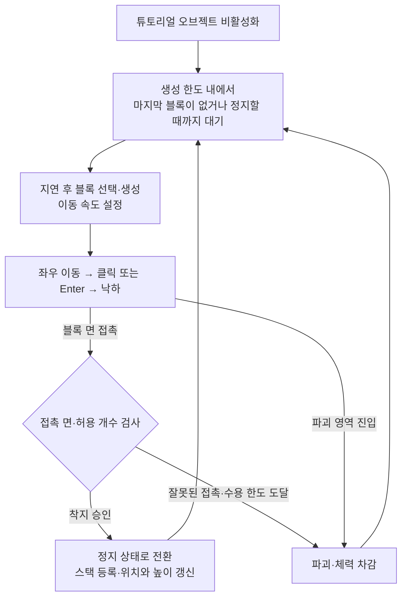
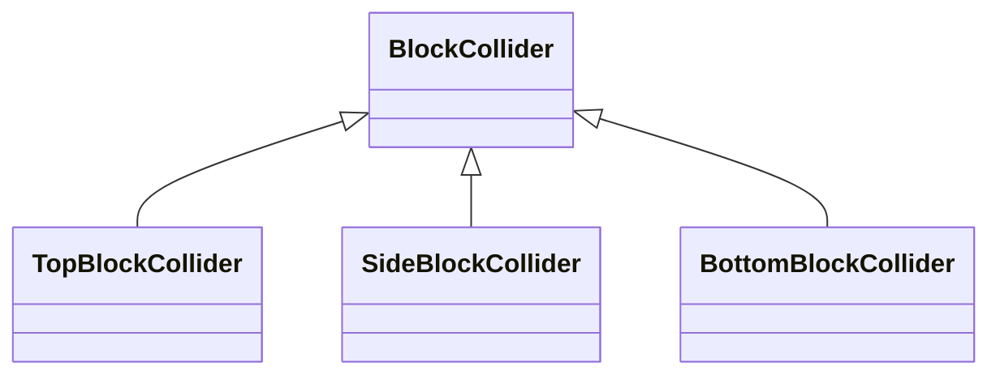
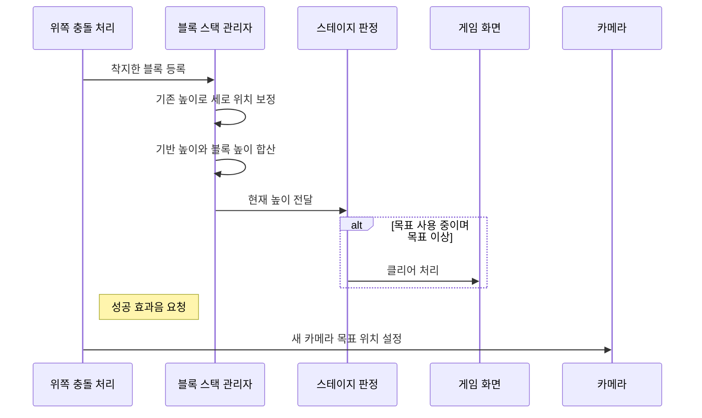

# 딸깍, 건축: 코드 구조와 실행 흐름

움직이는 블록을 원하는 순간에 떨어뜨려 건물을 쌓는 Unity 게임이다. 잘못 부딪히거나 블록을 놓치면 체력이 줄고, 정해진 높이에 도달하면 스테이지를 클리어한다. 저장소 이름에는 3D가 들어가지만, 공개 코드의 이동·충돌은 `Rigidbody2D`와 `Collider2D`를 사용한다.

- 개발: **2024.09~10**, 2024년 2학기 전기
- 팀: 윤재현(기획), 권민혁(프로그래밍), 한기승(프로그래밍)
- 권민혁 담당: **블록 이동·충돌, 카메라, 사운드 구현과 팀원 작업 통합**
- 환경 기록: C#, **Unity 2022.3.7f1**, TextMesh Pro 3.0.6

**이 저장소는 실행·빌드할 수 없는 코드 검토용 사본이다.** 씬·프리팹·음원·이미지와 Inspector 연결이 빠져 있다. 아래 설명은 공개된 소스의 호출과 조건을 정적으로 따라간 결과이며, 플레이 테스트 결과가 아니다. 코드 링크는 최초 공개 사본 커밋 [`fde125f`](https://github.com/als79gur49/2024_3D_TeamProject-code-portfolio/blob/fde125f042c314789e773753240ec0b3f8e4473a/README.md)에 고정했다.

## 1. 블록 하나의 생성부터 다음 생성까지

**입력으로 블록을 떨어뜨리면 충돌 처리가 착지 또는 파괴를 결정한다. 생성기는 마지막 블록이 정지 상태가 되거나 사라진 것을 확인해 다음 블록을 만든다.**

아래는 이동형 프리팹의 `IsMoving`이 켜져 있고, 필요한 오브젝트 참조가 연결된 경우의 흐름이다.

- **시작과 입력:** [BuildingSpawner.Start][spawner]가 튜토리얼 종료를 기다린 뒤 생성 반복을 시작한다. [PlayableMove][move]는 좌우로 이동하다 클릭 또는 Enter를 받으면 아래 방향 속도로 바꾼다. 튜토리얼을 닫는 입력은 클릭 또는 Space이며, UI가 끄는 오브젝트와 생성기가 기다리는 오브젝트의 연결은 씬 설정에 달려 있다.
- **착지와 파괴:** [TopBlockCollider][top]는 착지를 승인하면 `StopBlock → BlockManager.PushBlock`을 호출한다. [BlockManager][blocks]가 위치와 높이를 갱신하고, 그 과정에서 목표 높이 도달 여부가 판정된다. 잘못된 면 접촉이나 파괴 영역 진입은 블록 파괴·체력 차감으로 이어진다. 접촉 목록이 이미 허용 수에 도달했다면 쌓인 블록도 함께 제거한다.
- **다음 생성:** 충돌 처리기가 다음 블록을 직접 생성하지 않는다. `SpawnCoroutine`이 `lastBlock == null` 또는 `IsMoving == false`를 확인하고 `spawnDelay` 뒤에 생성한다. `maxSpawnCount`에 도달하면 생성 반복을 끝낸다.

그림은 블록 생성의 반복 흐름이다. 목표 높이·체력에 따른 결과 UI와 생성 반복은 별도로 처리하며, 종료 조건은 4절에서 설명한다.

## 2. 충돌 면과 접촉 개수로 착지·파괴 결정

[BlockCollider][collider]의 공통 조건은 **서로 다른 블록이며, 상대는 이동하면서 낙하 중이고, 자신은 그 상태가 아닐 것**이다. 보조 함수 `IsFalling`은 `IsMoving && IsFalling`을 반환하므로 자신이 반드시 정지 상태여야 하는 것은 아니다.

아래 그림은 상속 관계다. 각 파생 클래스가 물려받은 `OnTriggerEnter2D`에서 공통 조건을 검사하고, **상대 면**에 맞는 override를 실행한다.

| 자신 면 | 상대 면 | 조건과 처리 |
| --- | --- | --- |
| 위 | 아래 | 접촉 목록 수가 허용 수보다 작고 중복이 아니면 착지 등록 |
| 위 | 아래 | 접촉 목록 수가 이미 허용 수 이상이고 새 상대이면 쌓인 블록 전체와 상대를 파괴하고 체력 차감 |
| 위 | 옆 | 중복이 아니면 상대 파괴·체력 차감 |
| 옆 | 아래·옆 | 중복이 아니면 상대 파괴·체력 차감 |
| 아래 | 아래·옆 | override에 추가 처리 없음 |
| 모든 면 | 위 | 공통 처리에서 실행하는 동작 없음 |

위쪽 처리는 [TopBlockCollider][top], 옆쪽 처리는 [SideBlockCollider][side]에 구현되어 있고 [BottomBlockCollider][bottom]의 두 override는 비어 있다. 허용 수 비교는 `collidedBlocks.Count < MaxInteractableBlock`이며 **해당 위쪽 콜라이더의 접촉 목록 수**가 기준이다. `PrevGameObject`와 목록으로 중복 처리를 줄이고, `OnTriggerExit2D`에서 목록과 개수를 줄인다.

파괴 영역의 [DestroyBlock][destroy]은 이동 중 블록을 파괴하고 체력을 차감한다. 중복 상대 기록이 없어 실제 호출 횟수는 콜라이더 구성에 따라 달라질 수 있다.

## 3. 착지 등록에서 높이·카메라 갱신까지

착지가 승인되면 `StopBlock`으로 정지 상태를 설정하고 [BlockManager.PushBlock][blocks]을 호출한다. **정적 스택 등록 → 이전 높이로 위치 보정 → 높이 재계산** 순서다.

- **높이:** 새 블록의 y는 갱신 전 `BlocksHeight * 0.1f - 5`다. 기반값 **10**에 각 [BlockInfo.Height][info]를 더해 `StageManager.CurrentHeight`에 전달한다. 실제 미터로 확인된 값은 아니다.
- **화면 이동:** [CameraController][camera]는 블록 수가 `blockLimit`보다 적으면 설정된 `originPosition.position.y`, 그 이상이면 스택 최상단 높이와 보정값을 목표로 삼는다. x=0, z=-10을 유지하고 y를 `Mathf.Lerp`로 보간한다. [BackgroundFollowing][background]은 카메라의 세로 이동량에 추종 비율을 곱해 배경을 움직인다.
- **전체 붕괴:** 스택을 비우고 각 블록에 동일한 0.3초 지연 파괴를 요청한다. 높이·카메라 목표를 갱신하고, 생성 코루틴은 0.7초 뒤 재시작해 대기 조건과 `spawnDelay`를 다시 거친다. `StageManager.Awake`는 스테이지 시작 시 스택을 초기화한다.

높이 판정은 `PushBlock` 호출 안에서 실행되므로, 클리어 UI가 성공 효과음·카메라 요청보다 먼저 켜질 수 있다.

## 4. 결과 판정과 기록 저장

[StageManager][stage]는 프로퍼티 setter에서 결과를 판정한다. 체력 초기값은 3이며, [InGameUI][ui]가 체력 이벤트를 구독·해제하고 HP 이미지를 갱신한다.

| 변경되는 값 | 조건과 처리 |
| --- | --- |
| `CurrentHeight` | `targetOnOffSwitch`가 켜져 있고 목표 높이 이상이면 `gameClear` 호출 |
| `CurrentHealth` | `OnHealthChanged` 이벤트 발생. 0 이하이면 `gameOver` 호출 |

### 클리어와 메뉴 조회

`gameClear`의 순서는 **타이머 정지 → 최고 기록 저장 → 클리어 UI와 시간 표시 → GameManager 요청**이다. `SaveBestTime`은 더 빠른 기록만 `BestTime_{stageIndex}`에 저장한다.

[GameManager.StageClear][game]는 연결된 [LevelLock][lock]에 클리어 표시를 요청한다. `stageIndex >= levelReached`이면 다음 번호를 `levelReached`에 저장하도록 요청한다.

메뉴에서는 별도로 `InitializeStages`가 저장값으로 버튼·잠금·체크를 구성하고, [BestTimeDisplay.Start][best]가 최고 기록을 읽는다. 이는 클리어 호출의 직접적인 다음 단계가 아니다.

### 실패와 종료 이후

`gameOver`는 타이머를 멈추고 실패 UI를 연다. [BlockInfo.DestroyBlock][info]은 자식 스프라이트 이름이 `Object_00_02`이면 체력을 0으로 만든다. 실제 외형은 확인하지 않았다.

결과 UI가 켜지고 EventSystem이 있으면 [PlayableMove.Update][move]는 낙하 입력을 처리하지 않는다. 생성 코루틴·전체 물리를 멈추는 처리와 중복 종료 판정 가드는 없다.

`StopBlock`은 `IsMoving = false`, `rigid.isKinematic = true`만 설정한다. 속도 0 대입은 별도 `Update` 경로에 있으며, 위 UI 조건에서 포인터가 UI 밖이면 그 전에 return한다. **착지 후 항상 속도가 0이 된다고 보장할 수 없다.** 실제 움직임은 플레이 테스트하지 않았다.

## 5. 생성·입력·사운드의 구현 세부

### 블록 선택과 이동

[BuildingSpawner][spawner]는 `Chance`의 누적합을 `Rate`에 저장하고 난수보다 큰 첫 누적값으로 프리팹을 고른다. 위치를 선택해 생성한 뒤 수평·수직 속도를 설정한다. 실제 종류·가중치·위치·횟수는 미확인이다. 생성 한도 도달 후의 별도 성공·실패 처리는 없다.

[PlayableMove][move]는 `IsMoving && !IsFalling`일 때 임의의 좌우 속도를 주고 블록을 메인 카메라의 자식으로 둔다. [ReflectBlock][reflect]은 이름이 `Sprite`인 충돌 오브젝트의 부모에서 `HorizontalReflect`를 호출하며, 이동 중이고 아직 낙하하지 않는 블록만 반사한다.

낙하 입력은 `IsFalling`을 켜고 카메라의 자식 관계를 해제한다. `isAccelerating`이 꺼져 있으면 아래 방향 속도를 설정하며, 켜진 분기는 비어 있다. 가속 낙하는 구현된 기능으로 보지 않는다.

### 효과음과 씬 연결

[SoundManager][sound]는 씬 전환 후에도 유지된다. 이름·클립 목록에서 소리를 찾아 BGM과 효과음 AudioSource로 나눠 재생하고 AudioMixer로 볼륨을 조절한다.

- 착지: `TopBlockCollider`가 `Success` 효과음을 요청
- 파괴: `BlockInfo`가 `Fail` 효과음을 요청. 효과음 재생 중이면 볼륨 인자를 0.4로 낮춤
- 씬별 음악: [SceneBGMInitialize][bgm]는 이전·현재 빌드 인덱스가 모두 1 이하이면 음악을 유지하고, 그 외에는 설정된 BGM을 요청
- 버튼 전환: [SceneButton][button]은 효과음 재생에 성공하면 클립 길이 × 배율만큼 기다린 뒤 연결된 `ChangeScenes.Load`를 호출. 재생에 실패하면 대기 없이 전환 진행

## 6. 실행 전제와 검증 범위

- 생성기는 이동 속도만 설정한다. `IsMoving`을 켜는 C# 코드는 없으므로 이동형 프리팹의 초기값이 필요하다. 튜토리얼·UI·Rigidbody2D·MainBlock·카메라·오디오 참조도 제외된 씬과 Inspector 설정에 의존한다.
- [Timer][timer]는 활성 상태에서 처음부터 시간을 더한다. 생성기의 튜토리얼 대기와 타이머 시작은 직접 연결되어 있지 않다.
- 공개 C# 28개를 정적으로 검토했다. 그림의 관계·분기와 본문의 호출 순서를 코드와 대조했으며, Unity 실행·컴파일·플레이 테스트는 하지 않았다.

## 부록. 공개 범위·출처·검증 기록

코드 사본의 출처와 실행 제한 보기

### 기준과 포함 범위

- 원본은 비공개 `als79gur49/2024_3D_TeamProject`의 `main`, 커밋 `81e231be42c696d0763b8c9700f17e54c16c86f5`다. 원본 루트 트리는 `dab46bf44ad59c4d9a194038338ad84c70325d2a`이며 커밋 SHA와 구분한다.
- 최초 게시 기록상 원본 352개 파일 중 **30개**를 포함했다. C# 28개와 환경 문맥 2개이며, 322개를 제외했다. 생성 문서 5개를 합친 공개 사본은 35개 파일이다.
- 원본 경로와 소스 바이트를 보존한 검토용 사본이다. 이번 README 개정에서는 공개 사본의 코드만 읽었고, 비공개 원본이나 제외 자산을 추가로 취득하지 않았다.
- 원본에 없는 빌드·실행 설정을 보충하지 않았다. 전체 원본 프로젝트와 자산·의존성·Inspector 구성이 없으므로 Unity 실행, 컴파일, 테스트를 수행하지 않았다.

### 제외 자료와 환경

폰트 전체(맑은 고딕과 파생 SDF 포함), TextMesh Pro 리소스·셰이더·문서, 음원·텍스처·씬·프리팹·머티리얼·Unity meta·빌드 설정·캐시·바이너리와 원본 Git 이력은 제외했다. 빈 기본 템플릿에 가까운 `BackgroundChanger.cs`도 제외했다. 자체 소스의 UnityEngine, Unity UI, TMPro, Unity.VisualScripting, Unity.Collections와 조건부 UnityEditor API 참조는 남아 있다.

[에디터 버전](ReviewContext/ProjectSettings/ProjectVersion.txt)은 Unity 2022.3.7f1(revision `b16b3b16c7a0`)이다. [패키지 선언](ReviewContext/Packages/manifest.json)과 최초 감사 기록에는 TMP 3.0.6, Visual Scripting 1.9.4, Test Framework 1.1.33 등이 남아 있다. 선언 버전과 잠금 버전은 [VALIDATION.json](VALIDATION.json)의 `package_version_audit.packages`에 구분되어 있다. 설치·실행 검증을 뜻하지 않는다. 제외한 TMP 자산이나 음원·폰트 등의 개별 배포 버전은 확인되지 않았다. 최초 감사에서 DOTween/Pro의 포함·설치 버전 근거도 발견되지 않았다.

일부 원본 파일은 UTF-8이 아니다. 도구나 에디터에서 한글 주석이 깨져 보일 수 있으며, 이 문서 작업에서는 소스 인코딩·개행·코드를 바꾸지 않았다.

### 기여·권한·라이선스

사용자는 2026-10-01 KST에 팀원들이 현재 코드와 이름의 새 공개 저장소 게시에 동의했고 외부 차용 코드가 없다고 확인했다. 이는 사용자 확인 기록이며, 독립적인 법적 검증이나 파일 전체의 단독 저작 증명은 아니다. **새로운 라이선스를 부여하지 않는다.**

[CONTRIBUTIONS.md](CONTRIBUTIONS.md)는 main 31개 커밋·5개 브랜치·고유 37개 커밋의 기존 감사 결과를 정리한다. 커밋 수 29:2를 개인 기여율로 환산하지 않는다. 공동 수정, 초기 작성자 미확인, 수동 통합 기록을 유지한다. 이 문서의 원본 커밋 링크는 비공개 원본 접근 권한이 필요하다.

`PlayableMove.cs`와 `StageManager.cs`는 공동 수정 파일이다. UI·메뉴·시스템 반입 커밋의 작성자만으로 초기 구현자를 확정하지 않는다. 개인 담당과 팀 전체 구조는 기여 기록에서 구분한다.

### 과거 해시와 이번 문서 검증의 구분

[MANIFEST.csv](MANIFEST.csv)와 [VALIDATION.json](VALIDATION.json)은 최초 게시 준비 당시의 포함 파일·해시·제외 범위·검사 결과를 기록한다. 원본 파일 30개의 크기·Git blob SHA-1 및 SHA-256 대조, 비밀 패턴 검사 등은 당시 검사 기록이다. 패턴 검사는 모든 비밀정보의 부재를 보증하지 않는다.

**이번 변경은 README.md뿐이다. 기존 문서에 기록된 README 해시는 개정된 README의 현재 해시가 아니다.** “업로드 전”, “push하지 않음” 등의 과거 작업 상태도 현재 공개 여부를 나타내지 않는다. 상세 패키지 표와 최초 작업 기록은 [최초 README](https://github.com/als79gur49/2024_3D_TeamProject-code-portfolio/blob/fde125f042c314789e773753240ec0b3f8e4473a/README.md)에 보존되어 있다.

이번 설명은 공개 소스를 정적으로 추적하고 문서의 파일 링크와 다이어그램 연결을 점검한 결과다. Unity 플레이·빌드·테스트 통과를 주장하지 않는다. `.gitignore`는 허용 목록일 뿐 보안 경계가 아니며, 새 파일 공개 시 별도의 출처·비밀정보 검토가 필요하다.

[spawner]: https://github.com/als79gur49/2024_3D_TeamProject-code-portfolio/blob/fde125f042c314789e773753240ec0b3f8e4473a/Assets/Scripts/Spawn/BuildingSpawner.cs#L49-L145
[move]: https://github.com/als79gur49/2024_3D_TeamProject-code-portfolio/blob/fde125f042c314789e773753240ec0b3f8e4473a/Assets/Scripts/Block/PlayableMove.cs#L23-L108
[top]: https://github.com/als79gur49/2024_3D_TeamProject-code-portfolio/blob/fde125f042c314789e773753240ec0b3f8e4473a/Assets/Scripts/Block/TopBlockCollider.cs#L13-L74
[collider]: https://github.com/als79gur49/2024_3D_TeamProject-code-portfolio/blob/fde125f042c314789e773753240ec0b3f8e4473a/Assets/Scripts/Block/BlockCollider.cs#L27-L64
[side]: https://github.com/als79gur49/2024_3D_TeamProject-code-portfolio/blob/fde125f042c314789e773753240ec0b3f8e4473a/Assets/Scripts/Block/SideBlockCollider.cs
[bottom]: https://github.com/als79gur49/2024_3D_TeamProject-code-portfolio/blob/fde125f042c314789e773753240ec0b3f8e4473a/Assets/Scripts/Block/BottomBlockCollider.cs
[blocks]: https://github.com/als79gur49/2024_3D_TeamProject-code-portfolio/blob/fde125f042c314789e773753240ec0b3f8e4473a/Assets/Scripts/Block/BlockManager.cs#L15-L66
[stage]: https://github.com/als79gur49/2024_3D_TeamProject-code-portfolio/blob/fde125f042c314789e773753240ec0b3f8e4473a/Assets/Scripts/StageManager.cs#L23-L58
[ui]: https://github.com/als79gur49/2024_3D_TeamProject-code-portfolio/blob/fde125f042c314789e773753240ec0b3f8e4473a/Assets/Scripts/InGameUI.cs
[game]: https://github.com/als79gur49/2024_3D_TeamProject-code-portfolio/blob/fde125f042c314789e773753240ec0b3f8e4473a/Assets/Scripts/System/GameManager.cs#L33-L63
[lock]: https://github.com/als79gur49/2024_3D_TeamProject-code-portfolio/blob/fde125f042c314789e773753240ec0b3f8e4473a/Assets/Scripts/System/LevelLock.cs#L47-L118
[best]: https://github.com/als79gur49/2024_3D_TeamProject-code-portfolio/blob/fde125f042c314789e773753240ec0b3f8e4473a/Assets/Scripts/BestTimeMenu.cs#L8-L31
[camera]: https://github.com/als79gur49/2024_3D_TeamProject-code-portfolio/blob/fde125f042c314789e773753240ec0b3f8e4473a/Assets/Scripts/etc_/CameraController.cs#L34-L54
[destroy]: https://github.com/als79gur49/2024_3D_TeamProject-code-portfolio/blob/fde125f042c314789e773753240ec0b3f8e4473a/Assets/Scripts/etc_/DestroyBlock.cs
[info]: https://github.com/als79gur49/2024_3D_TeamProject-code-portfolio/blob/fde125f042c314789e773753240ec0b3f8e4473a/Assets/Scripts/Block/BlockInfo.cs
[background]: https://github.com/als79gur49/2024_3D_TeamProject-code-portfolio/blob/fde125f042c314789e773753240ec0b3f8e4473a/Assets/Scripts/etc_/BackgroundFollowing.cs
[reflect]: https://github.com/als79gur49/2024_3D_TeamProject-code-portfolio/blob/fde125f042c314789e773753240ec0b3f8e4473a/Assets/Scripts/etc_/ReflectBlock.cs
[sound]: https://github.com/als79gur49/2024_3D_TeamProject-code-portfolio/blob/fde125f042c314789e773753240ec0b3f8e4473a/Assets/Scripts/SoundManager.cs
[bgm]: https://github.com/als79gur49/2024_3D_TeamProject-code-portfolio/blob/fde125f042c314789e773753240ec0b3f8e4473a/Assets/Scripts/etc_/SceneBGMInitialize.cs
[button]: https://github.com/als79gur49/2024_3D_TeamProject-code-portfolio/blob/fde125f042c314789e773753240ec0b3f8e4473a/Assets/Scripts/Button/SceneButton.cs
[timer]: https://github.com/als79gur49/2024_3D_TeamProject-code-portfolio/blob/fde125f042c314789e773753240ec0b3f8e4473a/Assets/Scripts/System/Timer.cs
