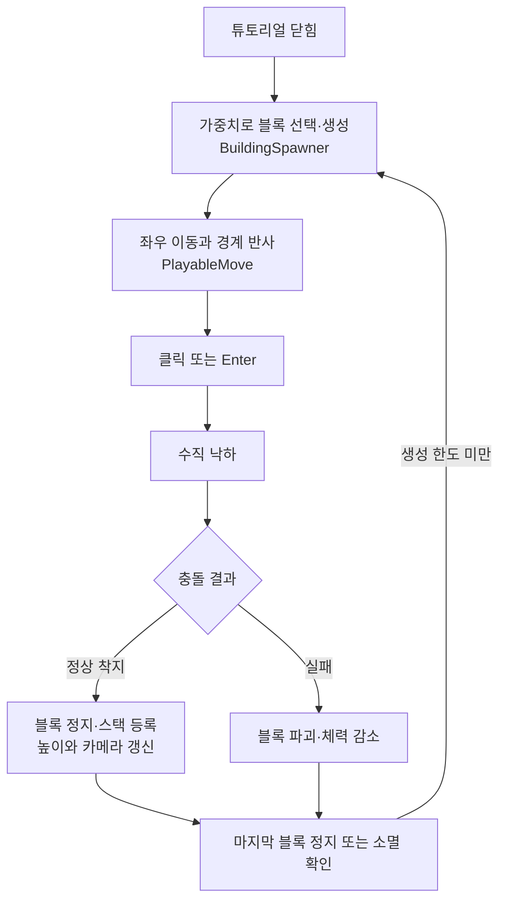
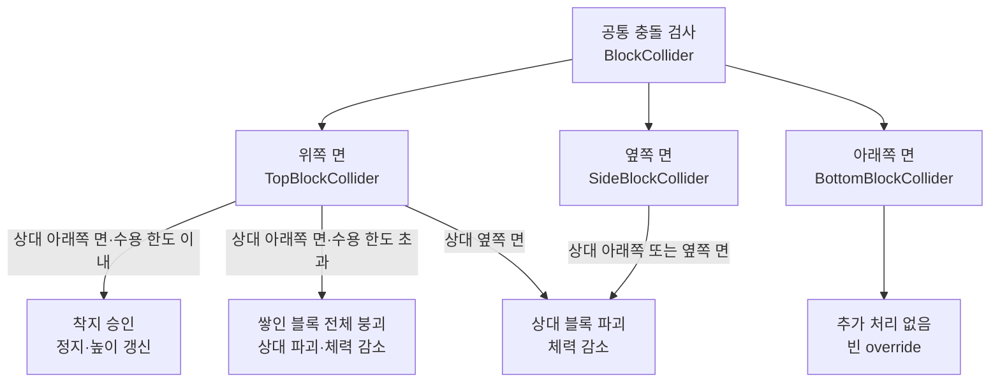
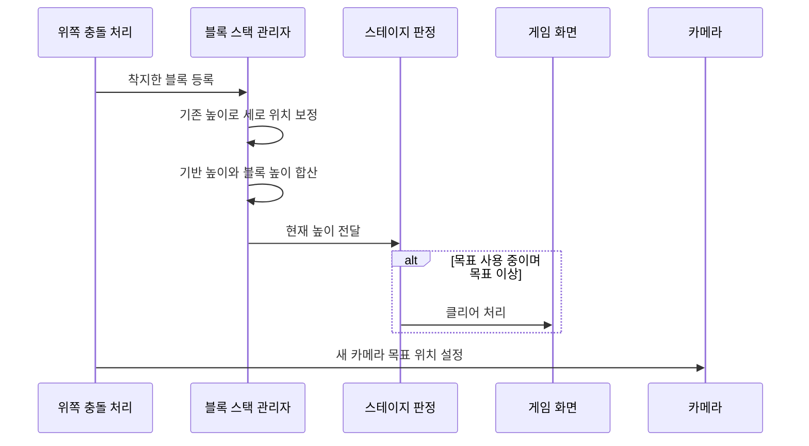

# 딸깍, 건축: 코드 구조와 실행 흐름

움직이는 블록을 원하는 순간에 떨어뜨려 건물을 쌓는 Unity 게임이다. 잘못 부딪히거나 블록을 놓치면 체력이 줄고, 정해진 높이에 도달하면 스테이지를 클리어한다. 저장소 이름에는 3D가 들어가지만, 공개 코드의 이동·충돌은 `Rigidbody2D`와 `Collider2D`를 사용한다.

- 개발: **2024.09~10**, 2024년 2학기 전기
- 팀: 윤재현(기획), 권민혁(프로그래밍), 한기승(프로그래밍)
- 권민혁 담당: **블록 이동·충돌, 카메라, 사운드 구현과 팀원 작업 통합**
- 환경 기록: C#, **Unity 2022.3.7f1**, TextMesh Pro 3.0.6

**이 저장소는 실행·빌드할 수 없는 코드 검토용 사본이다.** 씬·프리팹·음원·이미지와 Inspector 연결이 빠져 있다. 아래 설명은 공개된 소스의 호출과 조건을 정적으로 따라간 결과이며, 플레이 테스트 결과가 아니다. 코드 링크는 최초 공개 사본 커밋 [`fde125f`](https://github.com/als79gur49/2024_3D_TeamProject-code-portfolio/blob/fde125f042c314789e773753240ec0b3f8e4473a/README.md)에 고정했다.

## 1. 블록 하나가 쌓이기까지

**튜토리얼이 닫히면 블록이 생성되고, 좌우로 움직이는 블록을 클릭 또는 Enter로 떨어뜨린다.** 정상적으로 착지하면 블록을 멈추고 높이를 더한다. 생성기는 마지막 블록이 멈추거나 사라진 것을 확인한 뒤 다음 블록을 만든다.

그림은 블록의 반복 흐름이다. 목표 높이와 체력에 따른 종료 판정은 4절에서 따로 설명한다. 코드에는 결과 UI 표시와 별개로 생성기를 종료하는 통합 상태 전환이 없으므로, 이 그림이 종료 후 모든 동작의 정지를 보장하지는 않는다.

### 생성 조건과 가중치

[BuildingSpawner](https://github.com/als79gur49/2024_3D_TeamProject-code-portfolio/blob/fde125f042c314789e773753240ec0b3f8e4473a/Assets/Scripts/Spawn/BuildingSpawner.cs)의 `Start`는 `tutorialObject.activeSelf`가 꺼질 때까지 기다린다. 이후 `SpawnCoroutine`은 다음 순서를 반복한다.

1. 마지막 블록이 없거나 `PlayableMove.IsMoving == false`가 될 때까지 기다린다.
2. `spawnDelay`만큼 기다린 뒤 프리팹과 생성 위치를 선택한다.
3. 수평·수직 속도를 설정하고 생성 횟수를 늘린다.
4. `maxSpawnCount`에 도달하면 반복을 끝낸다.

`Building.Chance`는 선택 가중치다. `CalculateChance`에서 누적합을 `Rate`에 저장하고, `GetRandomIndex`가 난수보다 큰 첫 누적값을 고른다. 실제 블록 종류·가중치·생성 위치·횟수는 Inspector 자료가 없어서 확인할 수 없다. 최대 생성 횟수에 도달한 뒤의 별도 성공·실패 처리는 구현되어 있지 않다.

### 이동에서 낙하로 전환

[PlayableMove](https://github.com/als79gur49/2024_3D_TeamProject-code-portfolio/blob/fde125f042c314789e773753240ec0b3f8e4473a/Assets/Scripts/Block/PlayableMove.cs)는 `IsMoving`과 `IsFalling`으로 이동 상태를 구분한다.

- 수평 이동: `MovingHorizontal`이 임의의 좌우 방향으로 속도를 주고, 블록을 메인 카메라의 자식으로 둔다.
- 경계 반사: [ReflectBlock](https://github.com/als79gur49/2024_3D_TeamProject-code-portfolio/blob/fde125f042c314789e773753240ec0b3f8e4473a/Assets/Scripts/etc_/ReflectBlock.cs)이 이름이 `Sprite`인 충돌 오브젝트를 확인해 부모의 `HorizontalReflect`를 호출한다. 아직 낙하하지 않는 블록만 수평 속도를 반전한다.
- 낙하: 클릭 또는 Enter 입력으로 `IsFalling = true`가 되고, `MovingVertical`이 아래 방향 속도를 준다. 이때 카메라의 자식 관계를 해제한다.
- 착지: `StopBlock`이 `IsMoving = false`, `rigid.isKinematic = true`로 바꾸고, 이후 `Update`에서 속도를 0으로 만든다.

튜토리얼을 닫는 입력은 [InGameUI](https://github.com/als79gur49/2024_3D_TeamProject-code-portfolio/blob/fde125f042c314789e773753240ec0b3f8e4473a/Assets/Scripts/InGameUI.cs)의 클릭 또는 Space다. 낙하 입력의 Enter와 구분해야 한다. `isAccelerating` 분기는 비어 있어 가속 낙하는 구현된 기능으로 보지 않는다.

## 2. 충돌 위치에 따라 착지와 실패를 나누는 구조

[BlockCollider](https://github.com/als79gur49/2024_3D_TeamProject-code-portfolio/blob/fde125f042c314789e773753240ec0b3f8e4473a/Assets/Scripts/Block/BlockCollider.cs)가 공통 검사와 충돌 방향 분기를 맡고, 위·옆·아래 콜라이더가 세부 동작을 담당한다.

공통 조건은 **서로 다른 블록이며, 상대는 이동 중 낙하 상태이고, 자신은 그 상태가 아닐 것**이다. 코드의 `IsFalling` 보조 함수는 `IsMoving && IsFalling`을 반환한다. 따라서 주석의 “고정된 블록”은 실제 조건보다 좁은 표현이다.

- [TopBlockCollider](https://github.com/als79gur49/2024_3D_TeamProject-code-portfolio/blob/fde125f042c314789e773753240ec0b3f8e4473a/Assets/Scripts/Block/TopBlockCollider.cs): `collidedBlocks.Count`와 `BlockInfo.MaxInteractableBlock`을 비교한다. 한도 안이면 중복 등록을 검사한 뒤 상대를 멈추고 `BlockManager.PushBlock`을 호출한다. 이어 성공 효과음과 카메라 갱신을 요청한다.
- 한도를 초과하면 `BlockManager.DestroyAllBlocks`로 쌓인 블록 전체를 제거하고, 새로 부딪힌 블록도 파괴한 뒤 체력을 1 줄인다. 한도는 전체 건물의 최대 층수가 아니라 **해당 블록 위에 접촉해 있는 블록 수**를 기준으로 한다.
- [SideBlockCollider](https://github.com/als79gur49/2024_3D_TeamProject-code-portfolio/blob/fde125f042c314789e773753240ec0b3f8e4473a/Assets/Scripts/Block/SideBlockCollider.cs): 상대의 아래쪽 또는 옆쪽 면과 부딪히면 상대 블록을 파괴하고 체력을 1 줄인다.
- [BottomBlockCollider](https://github.com/als79gur49/2024_3D_TeamProject-code-portfolio/blob/fde125f042c314789e773753240ec0b3f8e4473a/Assets/Scripts/Block/BottomBlockCollider.cs): 상속 구조에 포함되지만 두 충돌 처리 override는 비어 있다.
- `PrevGameObject`와 `collidedBlocks`는 이미 처리한 상대의 중복 처리를 줄이기 위한 장치다. `OnTriggerExit2D`는 위쪽 면의 접촉 목록과 개수를 줄인다.

별도로 [DestroyBlock](https://github.com/als79gur49/2024_3D_TeamProject-code-portfolio/blob/fde125f042c314789e773753240ec0b3f8e4473a/Assets/Scripts/etc_/DestroyBlock.cs)은 파괴 영역에 들어온 이동 중 블록의 체력을 차감하고 파괴를 요청한다. 이 경로에는 위 충돌 클래스와 같은 중복 상대 기록이 없으므로, 실제 프리팹의 콜라이더 구성에 따른 호출 횟수는 코드만으로 확정할 수 없다.

## 3. 쌓인 높이와 화면을 함께 갱신하기

[BlockManager](https://github.com/als79gur49/2024_3D_TeamProject-code-portfolio/blob/fde125f042c314789e773753240ec0b3f8e4473a/Assets/Scripts/Block/BlockManager.cs)는 정적 `Stack<GameObject>`에 착지한 블록을 보관한다. 물리 시뮬레이션만으로 쌓인 높이를 재는 대신, 블록에 설정된 정수 높이와 위치 보정을 함께 사용한다.

`PushBlock`의 순서는 등록 → 위치 보정 → 높이 재계산이다. 위치는 갱신 전 `BlocksHeight * 0.1f - 5`를 세로 좌표로 사용한다. `SetBlocksHeight`는 기반 높이 **10**에 각 [BlockInfo.Height](https://github.com/als79gur49/2024_3D_TeamProject-code-portfolio/blob/fde125f042c314789e773753240ec0b3f8e4473a/Assets/Scripts/Block/BlockInfo.cs)를 더하고, 그 값을 `StageManager.CurrentHeight`에 전달한다. 이 수치는 코드 내부 높이 단위이며 실제 미터 단위로 단정하지 않는다.

전체 붕괴 시에는 다음 생성 코루틴을 0.7초 지연시키고, 스택을 비우면서 블록마다 0.3초 지연 파괴를 요청한다. 높이와 카메라 목표도 다시 계산한다. `StageManager.Awake`는 스테이지 시작 때 이 정적 스택을 초기화한다.

[CameraController](https://github.com/als79gur49/2024_3D_TeamProject-code-portfolio/blob/fde125f042c314789e773753240ec0b3f8e4473a/Assets/Scripts/etc_/CameraController.cs)는 쌓인 개수가 `blockLimit`보다 적으면 원점, 그 이상이면 스택 최상단 위치에 보정값을 더한 높이를 목표로 삼는다. 매 프레임 `Mathf.Lerp`로 이동한다. [BackgroundFollowing](https://github.com/als79gur49/2024_3D_TeamProject-code-portfolio/blob/fde125f042c314789e773753240ec0b3f8e4473a/Assets/Scripts/etc_/BackgroundFollowing.cs)은 카메라의 세로 이동량에 각 배경의 추종 비율을 곱해 하늘과 도시를 이동시킨다.

## 4. 성공·실패에서 기록과 다음 스테이지로

[StageManager](https://github.com/als79gur49/2024_3D_TeamProject-code-portfolio/blob/fde125f042c314789e773753240ec0b3f8e4473a/Assets/Scripts/StageManager.cs)는 높이와 체력의 프로퍼티 setter에서 판정한다.

| 변경되는 값 | 조건과 후속 처리 |
| --- | --- |
| `CurrentHeight` | `targetOnOffSwitch`가 켜져 있고 `targetHeight` 이상이면 `InGameUI.gameClear` 호출 |
| `CurrentHealth` | 변경할 때마다 `OnHealthChanged` 이벤트 발생. 0 이하이면 `InGameUI.gameOver` 호출 |

체력 초기값은 3이다. [InGameUI](https://github.com/als79gur49/2024_3D_TeamProject-code-portfolio/blob/fde125f042c314789e773753240ec0b3f8e4473a/Assets/Scripts/InGameUI.cs)는 활성화 때 체력 이벤트를 구독하고 비활성화 때 해제한다. 이벤트를 받으면 현재 체력에 맞춰 HP 이미지를 켜고 끈다.

클리어 흐름은 다음과 같다.

1. [Timer](https://github.com/als79gur49/2024_3D_TeamProject-code-portfolio/blob/fde125f042c314789e773753240ec0b3f8e4473a/Assets/Scripts/System/Timer.cs)를 멈추고 클리어 시간을 표시한다.
2. 이전 기록보다 빠를 때만 `BestTime_{stageIndex}` 키에 시간을 저장한다.
3. [GameManager.StageClear](https://github.com/als79gur49/2024_3D_TeamProject-code-portfolio/blob/fde125f042c314789e773753240ec0b3f8e4473a/Assets/Scripts/System/GameManager.cs)가 클리어 표시와 다음 스테이지 해제를 요청한다.
4. [LevelLock](https://github.com/als79gur49/2024_3D_TeamProject-code-portfolio/blob/fde125f042c314789e773753240ec0b3f8e4473a/Assets/Scripts/System/LevelLock.cs)이 `levelReached`를 PlayerPrefs에 저장한다. 스테이지 메뉴 초기화 때 이 값을 읽어 버튼·잠금·체크 표시를 구성한다.
5. [BestTimeMenu.cs의 BestTimeDisplay](https://github.com/als79gur49/2024_3D_TeamProject-code-portfolio/blob/fde125f042c314789e773753240ec0b3f8e4473a/Assets/Scripts/BestTimeMenu.cs)는 `BestTime_{i}`를 읽어 각 스테이지 최고 기록을 표시한다.

실패 시에는 타이머를 멈추고 게임 오버 UI를 연다. 추가로 `BlockInfo.DestroyBlock`은 자식 스프라이트 이름이 **`Object_00_02`**이면 체력을 0으로 설정한다. 특정 블록이 파괴되면 즉시 실패하는 규칙이 스프라이트 이름에 연결되어 있다. 실제 자산의 외형은 이 사본으로 확인하지 않았다.

## 5. 사운드와 씬 연결

[SoundManager](https://github.com/als79gur49/2024_3D_TeamProject-code-portfolio/blob/fde125f042c314789e773753240ec0b3f8e4473a/Assets/Scripts/SoundManager.cs)는 씬 전환 후에도 유지되는 싱글턴이다. Inspector에 설정된 이름·클립 목록에서 소리를 찾아 BGM용 AudioSource와 효과음용 AudioSource로 나눠 재생한다. 볼륨은 AudioMixer의 Master/BGM/Effect 파라미터로 조절한다.

- 정상 착지: `TopBlockCollider`에서 `Success` 효과음 요청
- 파괴: `BlockInfo`에서 `Fail` 효과음 요청. 효과음이 재생 중이면 볼륨 인자를 0.4로 낮춘다.
- 씬별 음악: [SceneBGMInitialize](https://github.com/als79gur49/2024_3D_TeamProject-code-portfolio/blob/fde125f042c314789e773753240ec0b3f8e4473a/Assets/Scripts/etc_/SceneBGMInitialize.cs)가 이전·현재 빌드 인덱스를 비교한다. 둘 다 1 이하인 경우에는 음악을 바꾸지 않고, 그 외에는 설정된 이름의 BGM을 재생한다.
- 버튼 전환: [SceneButton](https://github.com/als79gur49/2024_3D_TeamProject-code-portfolio/blob/fde125f042c314789e773753240ec0b3f8e4473a/Assets/Scripts/Button/SceneButton.cs)이 효과음을 재생하고 클립 길이 × 배율만큼 기다린 뒤 `ChangeScenes.Load`를 호출한다.

씬의 빌드 인덱스·음원 이름·AudioMixer 연결은 제외된 설정에 의존한다. 이 코드만으로 실제 화면 전환 순서나 음원을 복원할 수는 없다.

## 6. 구조를 읽을 때 주의할 점

이 프로젝트의 핵심은 **생성 코루틴, 두 이동 상태값, 방향별 충돌 상속, 정적 블록 스택, 프로퍼티 기반 판정**이 이어지는 구조다. 높이는 직접 호출로 전달하고, 체력 UI만 이벤트로 갱신한다. 모든 기능이 이벤트 기반으로 분리된 구조는 아니다.

- `gameClear`와 `gameOver`는 타이머와 UI를 처리하지만 생성기 중지나 전체 물리 정지를 직접 수행하지 않는다. 목표 판정에도 “이미 종료됨”을 기억하는 별도 가드가 없다.
- `Timer`는 초기부터 시간을 더한다. 생성기의 튜토리얼 대기와 타이머 시작이 직접 연결되어 있지는 않다. 실제 오브젝트 활성 시점은 씬 확인이 필요하다.
- `PlayableMove`는 UI·Rigidbody2D, 충돌 클래스는 `MainBlock`·자식 콜라이더, 카메라는 스택과 메인 카메라 구성에 의존한다. Inspector 참조가 없거나 잘못되면 같은 흐름이 성립한다고 보장할 수 없다.
- 일부 원본 파일은 UTF-8이 아니다. 도구나 에디터에서 한글 주석이 깨져 보일 수 있으며, 이 문서 작업에서는 소스 인코딩·개행·코드를 바꾸지 않았다.
- `PlayableMove.cs`와 `StageManager.cs`는 공동 수정 파일이다. UI·메뉴·시스템 반입 커밋의 작성자만으로 초기 구현자를 확정하지 않는다. 개인 담당과 팀 전체 구조는 [기여 기록](CONTRIBUTIONS.md)에서 구분한다.

## 부록. 공개 범위·출처·검증 기록

코드 사본의 출처와 실행 제한 보기

### 기준과 포함 범위

- 원본은 비공개 `als79gur49/2024_3D_TeamProject`의 `main`, 커밋 `81e231be42c696d0763b8c9700f17e54c16c86f5`다. 원본 루트 트리는 `dab46bf44ad59c4d9a194038338ad84c70325d2a`이며 커밋 SHA와 구분한다.
- 최초 게시 기록상 원본 352개 파일 중 **30개**를 포함했다. C# 28개와 환경 문맥 2개이며, 322개를 제외했다. 생성 문서 5개를 합친 공개 사본은 35개 파일이다.
- 원본 경로와 소스 바이트를 보존한 검토용 사본이다. 이번 README 개정에서는 공개 사본의 코드만 읽었고, 비공개 원본이나 제외 자산을 추가로 취득하지 않았다.
- 원본에 없는 빌드·실행 설정을 보충하지 않았다. 전체 원본 프로젝트와 자산·의존성·Inspector 구성이 없으므로 Unity 실행, 컴파일, 테스트를 수행하지 않았다.

### 제외 자료와 환경

폰트 전체(맑은 고딕과 파생 SDF 포함), TextMesh Pro 리소스·셰이더·문서, 음원·텍스처·씬·프리팹·머티리얼·Unity meta·빌드 설정·캐시·바이너리와 원본 Git 이력은 제외했다. 빈 기본 템플릿에 가까운 `BackgroundChanger.cs`도 제외했다. 자체 소스의 UnityEngine, Unity UI, TMPro, Unity.VisualScripting, Unity.Collections와 조건부 UnityEditor API 참조는 남아 있다.

[에디터 버전](ReviewContext/ProjectSettings/ProjectVersion.txt)은 Unity 2022.3.7f1(revision `b16b3b16c7a0`)이다. [패키지 선언](ReviewContext/Packages/manifest.json)과 최초 감사 기록에는 TMP 3.0.6, Visual Scripting 1.9.4, Test Framework 1.1.33 등이 남아 있다. 선언 버전과 잠금 버전은 [VALIDATION.json](VALIDATION.json)의 `package_version_audit.packages`에 구분되어 있다. 설치·실행 검증을 뜻하지 않는다. 제외한 TMP 자산이나 음원·폰트 등의 개별 배포 버전은 확인되지 않았다. 최초 감사에서 DOTween/Pro의 포함·설치 버전 근거도 발견되지 않았다.

### 기여·권한·라이선스

사용자는 2026-10-01 KST에 팀원들이 현재 코드와 이름의 새 공개 저장소 게시에 동의했고 외부 차용 코드가 없다고 확인했다. 이는 사용자 확인 기록이며, 독립적인 법적 검증이나 파일 전체의 단독 저작 증명은 아니다. **새로운 라이선스를 부여하지 않는다.**

[CONTRIBUTIONS.md](CONTRIBUTIONS.md)는 main 31개 커밋·5개 브랜치·고유 37개 커밋의 기존 감사 결과를 정리한다. 커밋 수 29:2를 개인 기여율로 환산하지 않는다. 공동 수정, 초기 작성자 미확인, 수동 통합 기록을 유지한다. 이 문서의 원본 커밋 링크는 비공개 원본 접근 권한이 필요하다.

### 과거 해시와 이번 문서 검증의 구분

[MANIFEST.csv](MANIFEST.csv)와 [VALIDATION.json](VALIDATION.json)은 최초 게시 준비 당시의 포함 파일·해시·제외 범위·검사 결과를 기록한다. 원본 파일 30개의 크기·Git blob SHA-1 및 SHA-256 대조, 비밀 패턴 검사 등은 당시 검사 기록이다. 패턴 검사는 모든 비밀정보의 부재를 보증하지 않는다.

**이번 변경은 README.md뿐이다. 기존 문서에 기록된 README 해시는 개정된 README의 현재 해시가 아니다.** “업로드 전”, “push하지 않음” 등의 과거 작업 상태도 현재 공개 여부를 나타내지 않는다. 상세 패키지 표와 최초 작업 기록은 [최초 README](https://github.com/als79gur49/2024_3D_TeamProject-code-portfolio/blob/fde125f042c314789e773753240ec0b3f8e4473a/README.md)에 보존되어 있다.

이번 설명은 공개 소스를 정적으로 추적하고 문서의 파일 링크와 다이어그램 연결을 점검한 결과다. Unity 플레이·빌드·테스트 통과를 주장하지 않는다. `.gitignore`는 허용 목록일 뿐 보안 경계가 아니며, 새 파일 공개 시 별도의 출처·비밀정보 검토가 필요하다.

